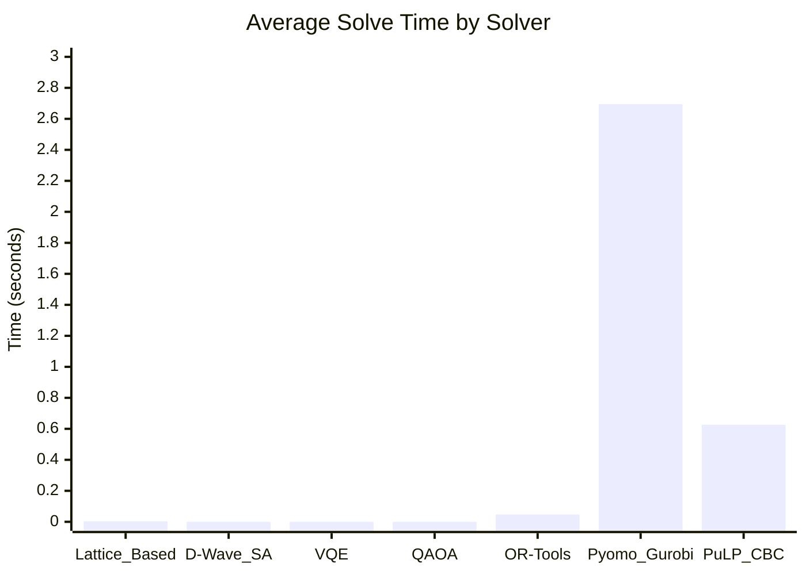

# Benchmark Results

This document presents the benchmark results from various solvers on the market split problem. The results are extracted from `benchmark_results.json`.

## Summary Table

| Solver       | Instances Tested | Successful Solutions | Avg Solve Time (s) | Avg Slack Total | Success Rate |
|--------------|------------------|----------------------|--------------------|-----------------|--------------|
| Lattice_Based | 3                | 3                    | 0.003313           | 1.67            | 1.0          |
| D-Wave_SA    | 3                | 3                    | 0.000007           | null            | 1.0          |
| VQE          | 3                | 3                    | 0.000005           | null            | 1.0          |
| QAOA         | 3                | 3                    | 0.000003           | null            | 1.0          |
| OR-Tools     | 3                | 3                    | 0.046970           | 0.0             | 1.0          |
| Pyomo_Gurobi | 3                | 3                    | 2.694901           | 0.0             | 1.0          |
| PuLP_CBC     | 3                | 3                    | 0.626069           | 0.0             | 1.0          |

## Average Solve Time Comparison

## Detailed Results

### Lattice_Based
- Instances: 3
- Avg Slack Total: 1.67

Individual times: 0.006929, 0.001701, 0.001308

### D-Wave_SA
- Instances: 3
- Avg Slack Total: null

Individual times: 0.000010, 0.000006, 0.000004

### VQE
- Instances: 3
- Avg Slack Total: null

Individual times: 0.000007, 0.000004, 0.000003

### QAOA
- Instances: 3
- Avg Slack Total: null

Individual times: 0.000004, 0.000003, 0.000003

### OR-Tools
- Instances: 3
- Avg Slack Total: 0.0

Individual times: 0.038708, 0.034198, 0.068005

### Pyomo_Gurobi
- Instances: 3
- Avg Slack Total: 0.0

Individual times: 6.744594, 0.619270, 0.720838

### PuLP_CBC
- Instances: 3
- Avg Slack Total: 0.0

Individual times: 1.044768, 0.381892, 0.451548
